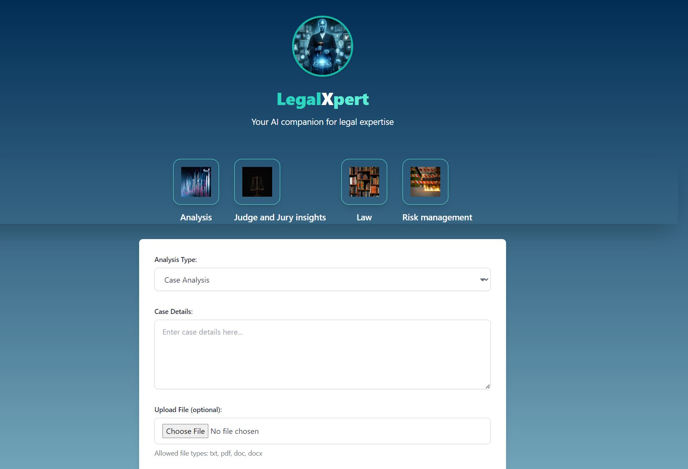
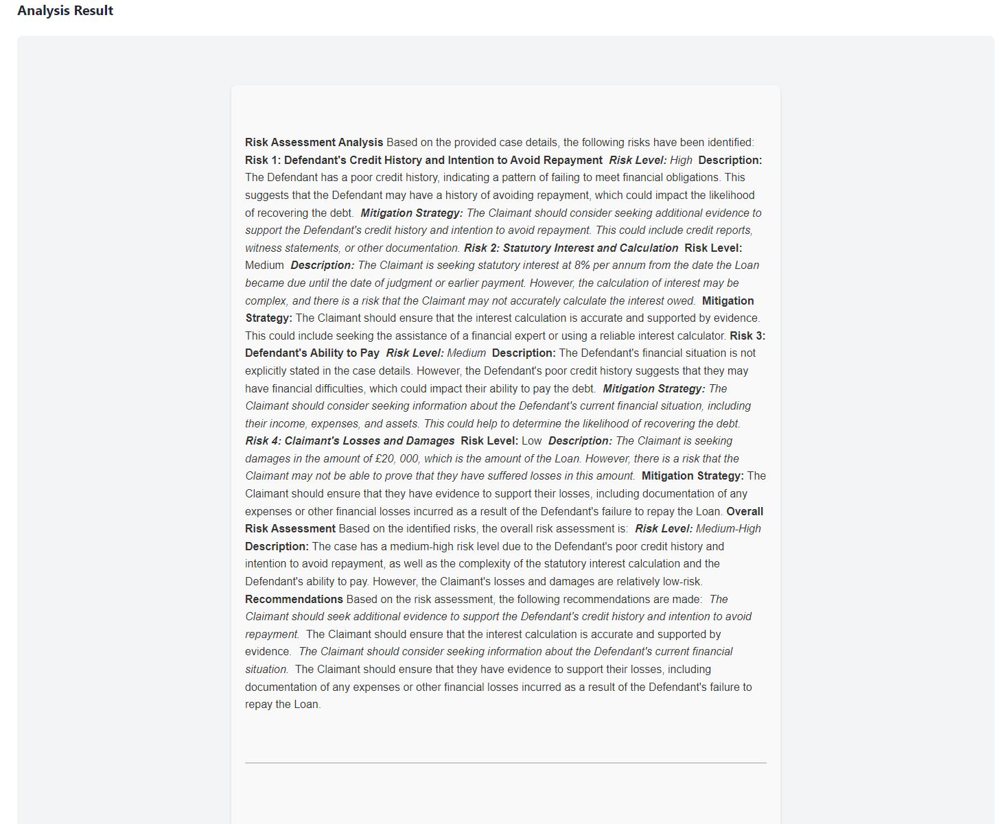
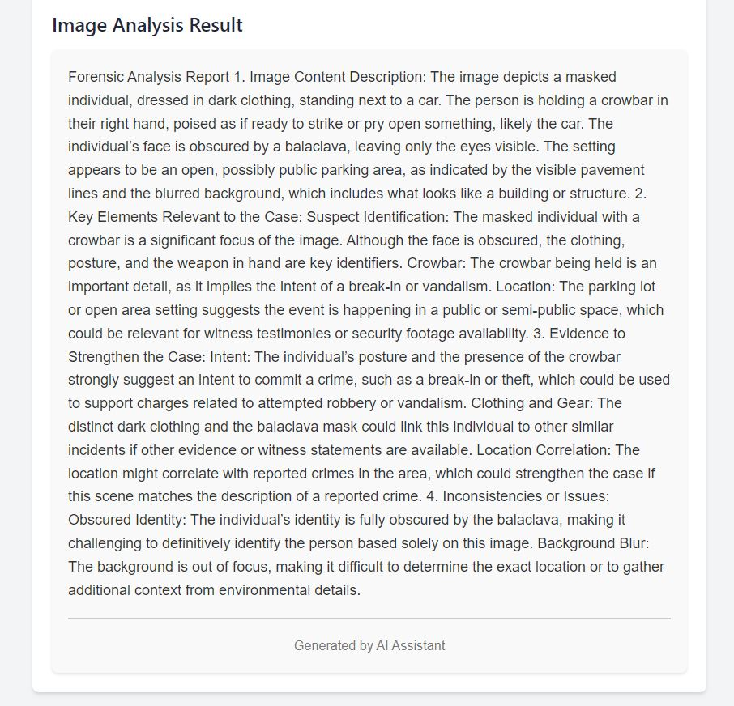

# AI-LegalXpert

AI LegalXpert based on [AI JSON](https://aijson.com/) is a sophisticated AI-powered legal assistant designed to assist users by providing comprehensive legal analysis, suggestions, and strategies. The application leverages the latest in natural language processing to analyze legal documents and provide actionable insights.

## Features

AI LegalXpert offers the following features:

1. **Document Analysis**: Upload legal documents in PDF, DOC, DOCX, or TXT formats, and receive a comprehensive analysis.
2. **Legal Strategy Suggestions**: Get recommendations for legal strategies based on the case details.
3. **Result Export**: Save or export the analysis results for later review.

## Installation / Setup

Follow these steps to set up and run AI LegalXpert on your machine:
1. **Clone the repository:**

   ```bash
   git clone https://github.com/hrch3k/ai-legalxpert.git
   cd ai-legalxpert
   ```

2. **Install dependencies:**

  Make sure you have Python 3.10 installed, then install the required Python packages:

   ```bash
   pip install -r requirements.txt
   ```

3. **Set up environment variables:**

  Create a .env file in the root of the project with the following content:

   ```bash
   AWS_REGION_NAME=your_aws_region
   AWS_ACCESS_KEY_ID=your_access_key_id
   AWS_SECRET_ACCESS_KEY=your_secret_access_key
  ```


4. **Run the application:**

  Start the Flask development server by running:

   ```bash
   python app.py
```


## Example Usage

Here are some examples of how AI LegalXpert works:

### Document Upload and Analysis

1. **Upload a legal document**: Users can upload legal documents in PDF, DOC, DOCX, or TXT formats. The application will read and extract text from the document.

2. **Select Analysis Type**: Choose from comprehensive analysis, brief summary, or strategy-focused analysis.

3. **View Results**: The application provides detailed insights, including key legal issues, potential strengths and weaknesses, and recommended legal strategies.

### Screenshot Examples

- **App:**

  

  

- **View Results:**

  


- **image forensycs:**

  

## Contributing

If you would like to contribute to AI LegalXpert, please follow these steps:

1. **Fork the repository.**
2. **Create a new branch** (`git checkout -b feature-branch`).
3. **Make your changes and commit them** (`git commit -am 'Add new feature'`).
4. **Push to the branch** (`git push origin feature-branch`).
5. **Create a new Pull Request.**

## License

AI LegalXpert is licensed under the MIT License. See `LICENSE` for more information.

## Contact

For any questions or issues, feel free to open an issue.

